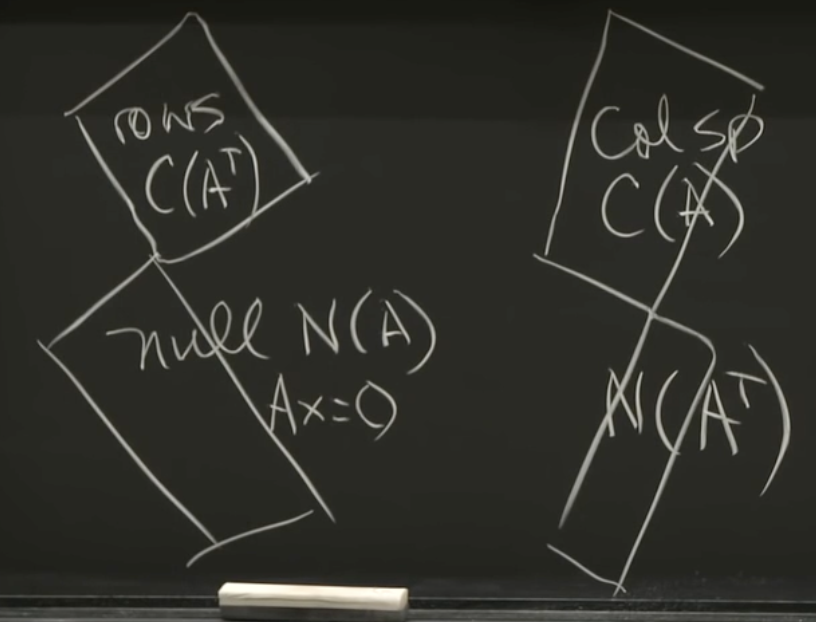

# Lecture 2:  multiplying and factoring matrices

## Five basic means of factoring matrices:
+ $A=LU$, elimination, solving linear systems
+ $A=QR$
+ $S=Q \Lambda Q^T$
+ $A=X \Lambda X^{-1}$
+ $A=U \Sigma V^T$

|symbol|meaning|
|-|-|
|$A$|Any Matrix|
|$L$|Lower Triangular Matrix|
|$U$|Upper Triangular Matrix|
|$Q$|Orthogonal/orthonormal Matrix($Q^TQ=I$)|
|$S$|Symmetric Matrix|
|$\Lambda$|Diagonal Eigenvalue Matrix|
|$X$|Eigenvector Matrix|

### 1. $A=LU$

A=LU, essentially Elimination:
$$
A=\begin{bmatrix}
2 & 3\\
4 & 7
\end{bmatrix} =
\begin{bmatrix}
1 & 0\\
2 & 1
\end{bmatrix}

\begin{bmatrix}
2 & 3\\
0 & 1
\end{bmatrix}
$$
**Elimination** $A=LU=\sum_i{col_i(L) row_i(U)}$.

> $col_i(L) row_i(U)$ makes up a **matrix whose rank is at most one**, which means all the non-zero rows or cols can be **represented linear** by any non-zero one.

Elimination keeps pulling off a rank 1 matrix (a col and a row) from A.

e.g.
$A=\begin{bmatrix}
2 & 3\\
4 & 7
\end{bmatrix} =
\begin{bmatrix}
2 & 3\\
4 & \underline{6}
\end{bmatrix}
+
\begin{bmatrix}
0 & 0\\
0 & \underline{1}
\end{bmatrix} = l_1 u_1^T + l_2 u_2^T$

$\begin{bmatrix}
2 & 3\\
4 & 6
\end{bmatrix}$ is the result of col1(L)$\times$row1(U)

For step i, we can make sure the i row will be reduced to zero for the rest steps.

### 2. $A=QR$
Gram-Schmidt method to get Q and R

### 3. $S=Q \Lambda Q^T$
Q has eigenvectors

$Q\Lambda=\lambda Q$, proof:

$Q \Lambda = 
\begin{bmatrix}
q_1 & q_2 & \cdots & q_n
\end{bmatrix}
\begin{bmatrix}
\lambda_1 & 0 & \cdots & 0\\
0 & \lambda_2 & \cdots & 0\\
0 & 0 & \cdots & \lambda_n
\end{bmatrix}
=\begin{bmatrix}
\lambda_1 q_1 & \lambda_2 q_2 & \cdots & \lambda_nq_n
\end{bmatrix}=\lambda Q
$​

For **Symmetric Matrix**, all the **eigenvalues are all real**, and the **Eigenvectors are orthonormal**, which compose the matrix Q.

$(Q \Lambda) Q^T = cols\ of (Q\Lambda) \times (rows\ of\ Q^T)$, a column times a row's rank is 1——building block to build something.

$S=(Q\Lambda)Q^T=\sum_i{col_i(Q\Lambda)row_i(Q^T)}=\sum_i{\lambda_i q_i q_i^T}$

every rank 1 pieces are symmetric.

$Sq_1=\sum_i{\lambda_i q_i q_i^T}q_1=\lambda_1 q_1 (q_1^Tq_1)+\sum_{i \neq 1}{\lambda_i q_i (q_i^Tq_1)}=\lambda_1 q_1$

So, orthogonal matrix $Q$ is the Eigenvectors of Symmetric Matrix S whose Eigenvalue Matrix is $\Lambda$.

### $A=X \Lambda X^{-1}$
proof.  $AX=X \Lambda X^{-1}X=X\Lambda=\lambda X$

### 5. $A=U \Sigma V^T$
**SVD**: (Orthogonal) $\times$ (Diagonal) $\times$ (Orthogonal). U and V can be different matrix. It works for every matrix that doesn't need to have eigenvalues.

## 4 Fundamental Subspace

Four spaces' relationship is the fundamental thereom of linear algebra.

$A_{m \times n},rank(A)=r$

|space|vector space|explanation|dim of space|
|-|-|-|-|
|column space $C(A)$|$R^m$|$Ax$ for all $x$|$r$|
|row space $C(A^T)$|$R^n$|$x^TA^T$ for all $x$|$r$|
|null space $N(A)$|$R^n$|All solutions for $Ax=0$|$n-r$|
|null space $N(A^T)$|$R^m$|$x$ for $A^Tx=0$|$m-r$|

for a 2x3 matrix A, $Ax=\begin{bmatrix}* & * & *\\ *&* & *
\end{bmatrix} \begin{bmatrix}* \\ * \\ * \end{bmatrix}$, so $C(A^T)$ and $N(A)$ are both subspaces of $R^n$.

e.g.
$A=\begin{bmatrix}
1 & 2 & 4\\
2 & 4 & 8
\end{bmatrix}, m=2,n=3,r=1,N(A)=n-r=3-1=2$
So we can find 2 basis for solution x to $AX=0$. Such as:
$
x_1=\begin{bmatrix}
0\\-2\\1
\end{bmatrix},
x_2=\begin{bmatrix}
4\\0\\-1
\end{bmatrix}$,then any solution $x^*$ can be represented as $x^*=a_1x_1+a_2x_2$.

All vectors in $C(A^T)$ are **orthogonal** to those in $N(A)$, for all row $r$ in $A$, $rx^*=0$, so we come to the conclusion：

> $C(A^T)\bot N(A)$ in $R^n$, $C(A)\bot N(A^T)$ in $R^m$.

