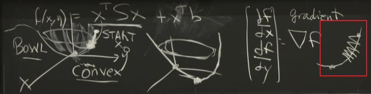

# Lecture 5:  Positive Definite and Semidefinite Matrices

## Positive Definite Matrices

PD Matrices are the best symmetric matrices, which have positive Evalues. Adding stuff to the main diagonal makes the matrix more positive.

For any **Symmetric Matrix $S$**, if it meets any of the tests below, it is a **Positive Definite Matrix**.

1. All $\lambda_i > 0$ ==> PD matrices have positive determinants.

2. **Energy $x^TSx > 0$** ($\forall x \neq 0$). **important!**

   > Energy is **bowl-like quadratic function**: $\begin{bmatrix}x & y\end{bmatrix} \begin{bmatrix}
   > 3 & 4 \\
   > 4 & 6
   > \end{bmatrix} \begin{bmatrix}x \\ y\end{bmatrix} = 3x^2+8xy+6y^2 >=0$, $x^2$ and $y^2$ are always positive upwards, $xy$ brings negative things. Whether the quadratic function is convex depends on whether these positive pieces can overwhelm it.
   >
   > The Energy of this PD Matrix reaches the **minimum point at $(0,0)$ with $f(x,y)=0$.** Deep learning is actually minimize some energy.
   >
   > For usual model, we want to optimize the function $f=x^TSx+x^Tb$.
   >
   > This is still **a bowl like convex function**, we need **Gradient Descent Method** to find the minimum point. Gradient tells us the steepest direction.
   >
   > Second derivatives can give a fancier formula accounting for the curve, but it's hard to compute w.r.t. thousands of variables
   >
   > If there are **small and large eigenvalues**, the bowl becomes long and thin, and it becomes **hard to search the minimum**. ??? not understand
   >
   > 

3. $ S = A^TA$  (independent col in A).

4. All leading determinants > 0. (顺序主子式>0)

   > $$S = \begin{bmatrix}
   > 3 & 4 \\
   > 4 & 5
   > \end{bmatrix}, det(S)=-1=\lambda_1\lambda_2<0, \therefore \exists \lambda_i<0$$ Not PD. 

5. All pivots in elimination > 0. (消元法主元>0)

   > $$S = \begin{bmatrix}
   > 3 & 4 \\
   > 4 & 6
   > \end{bmatrix} -> elimination ->  \begin{bmatrix}
   > 3 & 4 \\
   > 0 & 2/3
   > \end{bmatrix}$$, and the pivots=$3,2/3 >0$, so it's PD matrix 

### examples:

1.  $S,T$ are PD, $S+T$ is PD too.

   > rule 2: $x^T(S+T)x = x^TSx + x^TTx >0 (\forall x \neq 0)$

2.  $S$ is PD, so is $S^{-1}$.

   > rule 1: $\lambda_i' = 1/\lambda_i >0$

3.  $S$ is PD, $Q$ is **orthogonal matrix** ($Q^{-1}=Q^T$). $Q^TSQ$ is PD.

   > method 1:  rule 1: similar $S \sim Q^TSQ$, same eigenvalues
   >
   > method 2:  rule 2: $x^TQ^TSQx = (x^TQ^T)S(Qx) = y^TSy>0, \forall x>0$

## Positive Semidefinite Matrices ——PSD

PD matrices are a clump in the matrix space, PSD matrices are the edge of that clump, not inside not outside. Semidefinite is the borderline with evalues, determinants = 0.

For any **Symmetric Matrix $S$**, if it meets any of the tests below, it can be consulted as **Positive Semidefinite Matrix**.

1. All $\lambda_i \ge 0$.  
2. **Energy $x^TSx \ge 0$** ($\forall x \neq 0$). 
3. $ S = A^TA$  (dependent col allowed in A).
4. All leading determinants $\ge$ 0.

### examples:

1. $$S= \begin{bmatrix}
   3 & 4 \\
   4 & 16/3
   \end{bmatrix}, det(S)=\lambda_1\lambda_2=0, trace=\lambda_1+\lambda_2=25/3>0.\lambda=25/3,0>=0.$$ So $S$ is PSD.

2.  $$S= \begin{bmatrix}
   1 & 1 & 1 \\
   1 & 1 & 1 \\ 1 & 1 & 1
   \end{bmatrix}, rank=1, trace=0, \lambda=3,0,0.$$ $$ S=Q \Lambda Q^T = \lambda_1 q_1 q_1^T + \lambda_2 q_2 q_2^T + \lambda_3 q_3 q_3^T = \lambda_1 q_1 q_1^T = 3 \begin{bmatrix}1/\sqrt3 \\ 1/\sqrt3 \\ 1/\sqrt3\end{bmatrix} \begin{bmatrix}1/\sqrt3 && 1/\sqrt3 && 1/\sqrt3\end{bmatrix}$$

For Symmetric Matrices, $S = \sum_i\lambda_i q_i q_i^T$
