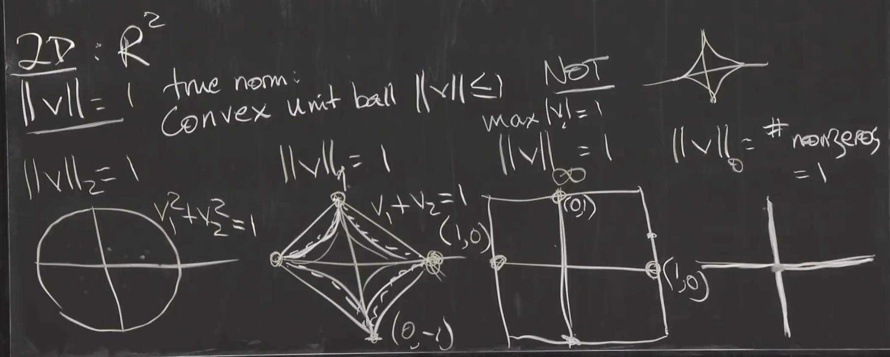
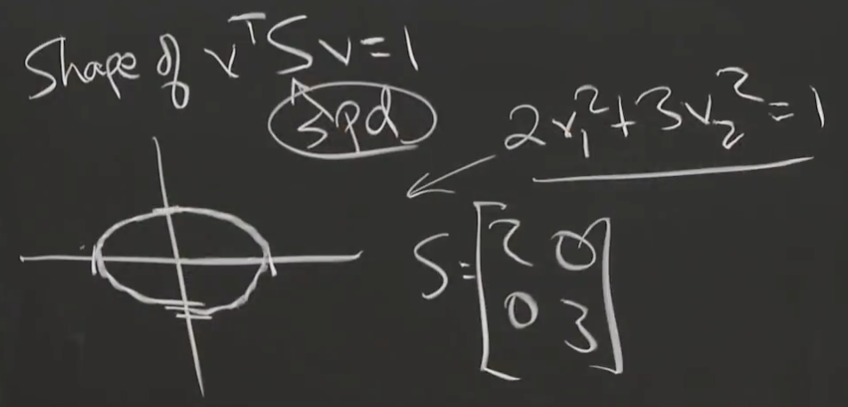
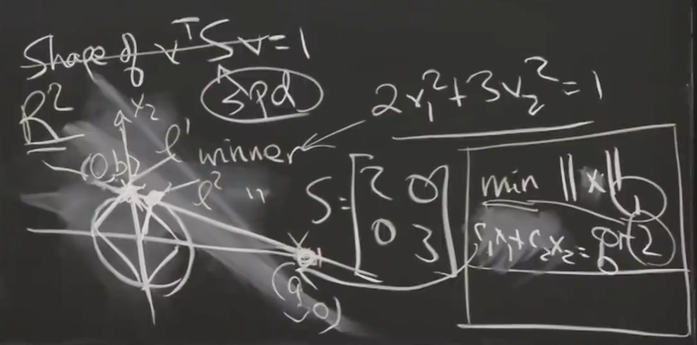

# 8. Norms of Vectors and Matrices

## Vector Norm

a norm is a way to measure the size of a vector, matrix, tensor or function.

P-norm: $||v||_p = (|v_1|^p+\dots+|v_n|^p)^\frac{1}{p}$

2-norm: $||v||_2 = \sqrt{|v_1|^2+\dots+|v_n|^2}$

1-norm: $||v||_p = |v_1|+\dots+|v_n|$

0-norm: $||v||_0$ is number of non-zero components, 0-norm is not a good norm, lack of norm's property (linear).

### Picture of Norms

The plot of $v \in \mathbb{R}^2, ||v||=1$:

start with p=1 from a diamond, then swell out to be a circle at p=2, then keeps swelling to be a square (p=inf)

True norm: have convex unit ball$(||v|| \le 1)\ (p>1)$. $p = 0, 1/2$ are bad norms. True norm has linear property, $||2v|| = 2||v||$.

S-norm: $||v||_S = \sqrt{v^TSv}$. S is a symmetric positive definite matrix, we call it the energy of $v$.

When S is an identity, S-norm is 2-norm.

Shape of S-norm s.t. $v^TSv=1$ is an ellipse, different ellipse fot different S. We can see that S-norm is an adjustable norm, a weighted norm:

### Fundamental Optimization:

The basis picture for minimizing something with a constraint, which is a fundamental problem of optimization:
$$
min ||x|| \\
s.t.\ Ax = b
$$
where $x$ lands in a hyperplane. Basis Pursuit for l1 norm. Ridge Regression for l2 norm.

For Basis Pursuit, the minimum x must has a 0 component.

## Matrix Norm

Matrix norm from vector norm:
$$
||A||_2 = \max_{all\ x}\frac{||Ax||_2}{||x||_2}
$$
See which vector gets blown up the most after times $A$, the maximum blowing up ratio is the norm of $A$.

For 2-norm, the 1st singular vector brings the maximum:
$$
\frac{||Av_1||=||\sigma_1u_1||}{||v_1||=1} = \sigma_1
$$
Frobenius Norm: $||A||_F = \sqrt{\sum|a_{ij}|^2} = \sqrt{\sigma_1^2+\dots+\sigma_n^2}$.

Why $\sqrt{\sum|a_{ij}|^2} = \sqrt{\sigma_1^2+\dots+\sigma_n^2}$: do SVD for A: $A = U\Sigma V^T$, $U, V$ are orthogonal matrix, 正交变换保范数，要问为什么正交/酉变换保范数，请见哈工大矩阵分析课程, so $||A|| = ||\Sigma||$

### Nuclear Norm:

Conjecture: In deep learning, there are many more weights than samples, so there are a lot of possible minima. Many different weights give the same minimum loss, because there are so many weights.

The optimization by gradient descent picks out the weight that minimize the nuclear norm, it will be a norm of a lot of weights. That's where the deep learning system goes. Srebro.

$||A||_N = \sigma_1 + \dots + \sigma_n$